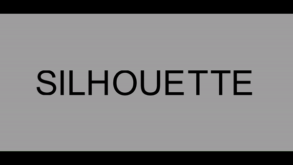

# Silhouette Illusion
Check out the webpage [here](https://omri-shavit.github.io/SilhouetteIllusion/)!

### Usage
Take a look at the `Controls` panel (programmed using [dat gui](https://github.com/dataarts/dat.gui))

Type in your two messages in `Message 1` and `Message 2` to create your custom Silhouette Illusion
 - Note: only alphabetic characters and spaces are supported ( everything else is ignored 😢) 
 - Characters are also capitalized automatically

You can also set color, spacing, and toggle the animation cycle seen above in the control pannel. As you'll notice, any change you via the controls will alter the URL

### Sharing
You can share the customized illusion by copying the generated link! For example, here's the link generated for the "JOHN / SMITH" illusion seen above:

https://omri-shavit.github.io/SilhouetteIllusion/?message1=JOHN&message2=SMITH&isCycling=true

You can also download the STL file via the controls and 3D print a sculpture to keep! However, I recommend adding a base for the letters to stand on

## How it works
Every mesh for every letter combination seen is precomputed and lazily loaded. 
For a given letter combination, we extrude two prisms and take their boolean intersection.

When one message is longer than the other, we begin to
split the letters of the shorter message into left and right halves. If the longer message is more than twice the length
of the shorter message, we begin to double up the letters of the longer message.

So every letter has three variants: full, left-half, and right half. $26$ letters times $3$ letter variants = 78 unique variants, 
We wrote a script for Fusion360 to generate $(26*3)^2=6084$ meshes
